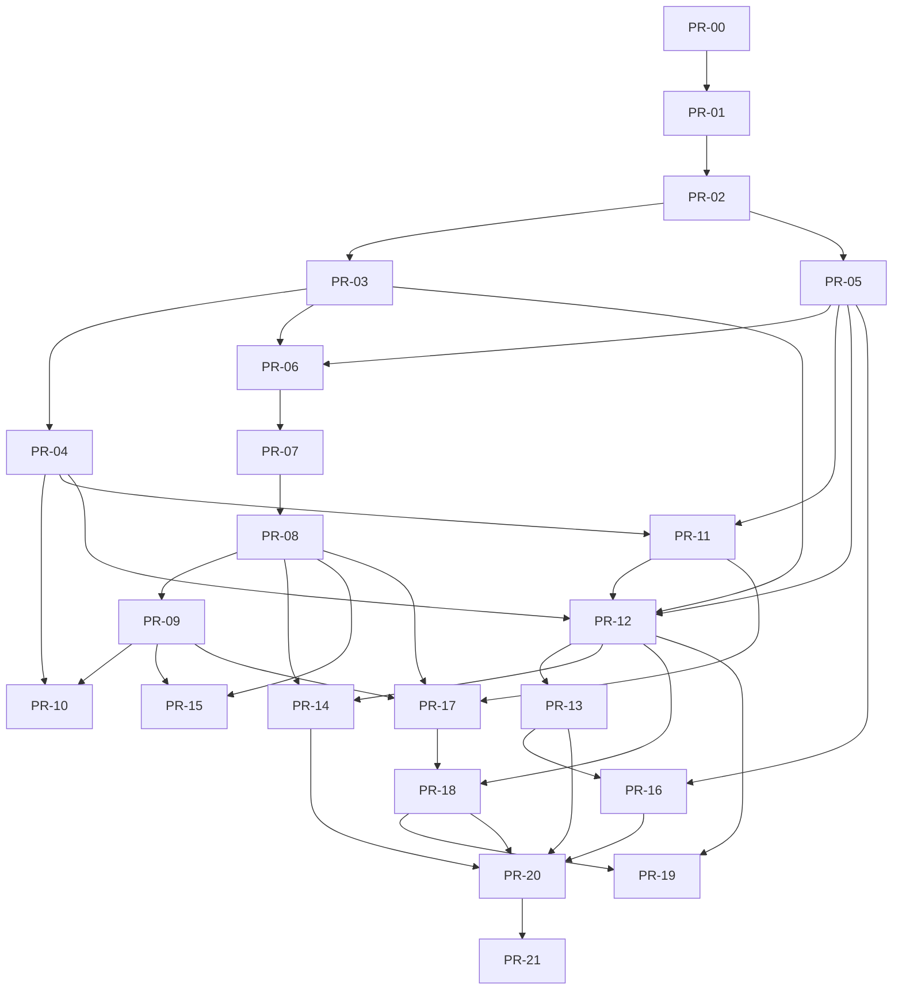

# PR Dependency Graph v0.4.0

## Mermaid

## Dependency Rules

- A task may read future docs but may not implement future behavior unless its dependency chain is complete.
- A schema/registry change must update validation tests in the same task.
- A provider task must not add app-owned behavior to Odin.
- A UI task must render state from API/contracts; it must not become a second runtime authority.

## v0.5.1 Full Shadow Runtime Coverage Update

- Added PR-24 — Full Shadow Runtime Coverage.
- Added REAL-PR-10 — Full Shadow Runtime Coverage.
- Rule: all future changes must update architecture/specs, internal PR ladder, REAL-PR bundle registry, shadow contract registry, System Map, tests and FILE_MANIFEST.
